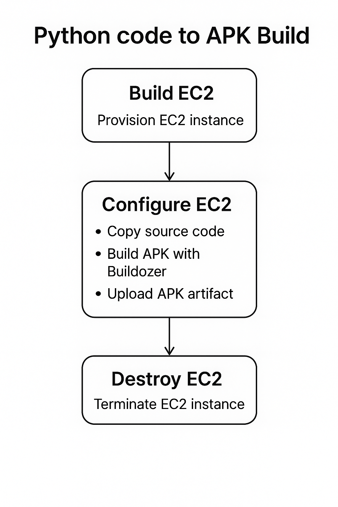

# Ephemeral Pipeline: Python to Android with GitHub Actions and AWS EC2 – Part 1

> Leveraging an ephemeral infrastructure to automate building Android applications from Python code using GitHub Actions, Terraform, and AWS EC2.

## Introduction

Continuous integration and continuous delivery (CI/CD) have significantly streamlined the software deployment lifecycle. However, the complexities of mobile app development, particularly compiling Python-based apps into Android APKs, require specialized environments. This blog series demonstrates an automated, ephemeral pipeline leveraging GitHub Actions, Terraform, and AWS EC2 to dynamically provision, configure, build, and teardown the infrastructure necessary for compiling Python code into Android applications.

In this first part, we focus on setting up the ephemeral infrastructure using Terraform and initiating our automated pipeline with GitHub Actions. Subsequent posts will cover the build process in detail and discuss cleanup and optimization strategies.

## Key Points

### Ephemeral Infrastructure
- **Ephemeral** means temporary; infrastructure is created for specific tasks and torn down afterward, reducing costs and improving security.
- **Terraform** is used for provisioning AWS EC2 instances dynamically.

### Automation with GitHub Actions
- Triggered by pushes to specific files, such as Terraform scripts, Dockerfiles, and Buildozer configurations.
- GitHub Actions orchestrate Terraform initialization, infrastructure provisioning, and verification of EC2 instances' readiness.

### Provisioning Infrastructure
- Terraform initializes and applies configuration scripts, creating EC2 instances configured specifically for building Android apps from Python.
- Outputs from Terraform (instance IP and ID) are captured and passed forward in the pipeline for subsequent steps.

### Security and Configuration
- Secure SSH access is configured dynamically using injected environment variables and key management.
- Infrastructure readiness checks ensure SSH and instance status before moving to the next pipeline phase.

## Terraform and GitHub Actions Workflow

Below is an overview of the pipeline workflow managed by GitHub Actions:

### Checkout Code & Terraform Setup
- Actions clone the repository and configure Terraform environment (`terraform init`).

### Provision EC2 Instance
- Terraform creates the EC2 instance and outputs IP and instance ID, stored for later pipeline steps.

### Instance Readiness Checks
- AWS CLI ensures the instance status is "OK," and the pipeline waits until SSH access is available.

### Configure SSH for Environment Variables
- Modifies SSH configuration on EC2 instance to pass required Docker credentials securely.

### Preserve Terraform State
- Terraform state files are saved as artifacts, allowing subsequent pipeline jobs to reuse configuration and manage the ephemeral lifecycle effectively.

## Conclusion

This first stage lays the foundation for automating Python-to-Android builds using an ephemeral CI/CD pipeline. Utilizing GitHub Actions alongside Terraform ensures efficient, secure, and cost-effective infrastructure management. In Part 2, we'll dive deeper into configuring the EC2 instance for building Android APKs using Docker and Buildozer.