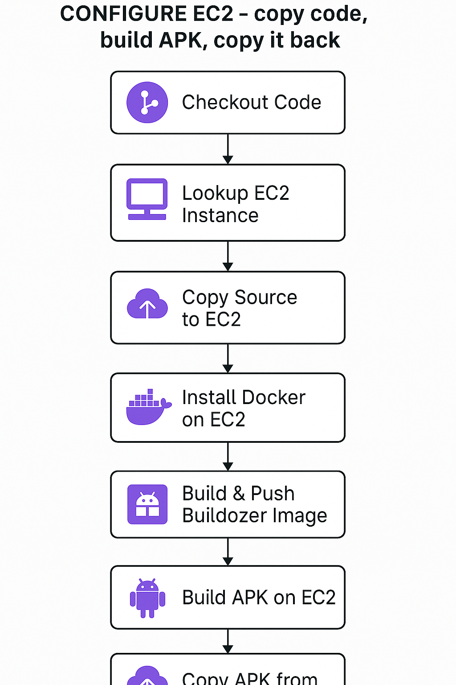

> In this second installment, we configure our AWS EC2 instance to use Docker and Buildozer to compile Python code into Android APKs seamlessly.

## Introduction

In Part 1, we set up our ephemeral infrastructure using Terraform and GitHub Actions. Now, we focus on configuring the EC2 instance with Docker and Buildozer, essential tools to automate the process of building Python-based Android applications. By utilizing Docker, we ensure consistent environments, simplifying the build process and making it highly repeatable.

This blog walks you through the essential steps to configure the instance, build a Docker image pre-loaded with Buildozer dependencies, and execute an APK build directly on the AWS EC2 instance.

## Key Points

### EC2 Configuration and Setup

- **Secure Transfer of Source Code:**
  - Use `scp` to securely transfer your project's source code to the EC2 instance.
  - Extract source files directly on the instance to prepare for the build.

- **Docker Installation and Configuration:**
  - Automatically install Docker on the Amazon Linux 2 instance.
  - Configure user permissions to allow Docker usage without requiring sudo privileges.

### Building and Pushing Docker Images

- **Dockerfile Creation:**
  - Define a Dockerfile (`Dockerfile.buildozer`) that installs Buildozer and all necessary Android build dependencies.
  - This Dockerfile ensures the environment is reproducible and pre-configured for rapid builds.

- **Automated Image Push:**
  - Build Docker images on GitHub Actions runners.
  - Automatically push Docker images to GitHub Container Registry (GHCR), enabling easy retrieval during builds.

### Executing Builds on EC2

- **Pull and Run Docker Container:**
  - SSH into EC2 and securely authenticate with GHCR.
  - Pull the custom Buildozer Docker image from GHCR.
  - Mount the local application directory into the Docker container, ensuring builds occur within the isolated container environment.

- **APK Generation:**
  - Run the Buildozer command within Docker (`buildozer android debug`) to compile the APK.
  - This approach provides a consistent, clean environment for each build.

### Retrieving the APK

- **Automated APK Retrieval:**
  - Use secure file transfer (`scp`) to copy the generated APK back to the GitHub Actions runner.
  - Upload the APK as an artifact for easy distribution and testing.

## Workflow Steps Overview

- **Copy Source to EC2:**
  - Compress the application source and securely transfer it via `scp`.

- **Docker Setup on EC2:**
  - Install Docker and configure permissions on the EC2 instance.

- **Docker Image Handling:**
  - Build Docker images with necessary dependencies and push them to GHCR from GitHub Actions.

- **APK Build Process:**
  - Execute the build inside the Docker container on EC2, ensuring a clean and controlled build environment.

- **Retrieve and Store APK:**
  - Copy the built APK from the EC2 instance back to GitHub Actions, making it available as a downloadable artifact.

## Conclusion

In this second part, we've effectively leveraged Docker and Buildozer to streamline Android APK builds within an ephemeral EC2 environment. Docker's portability ensures a repeatable build environment, reducing build inconsistencies and speeding up development cycles.

Stay tuned for the final part of this series, where we'll discuss automating the teardown process and optimizing costs using Terraform to manage the lifecycle of ephemeral infrastructure efficiently.
