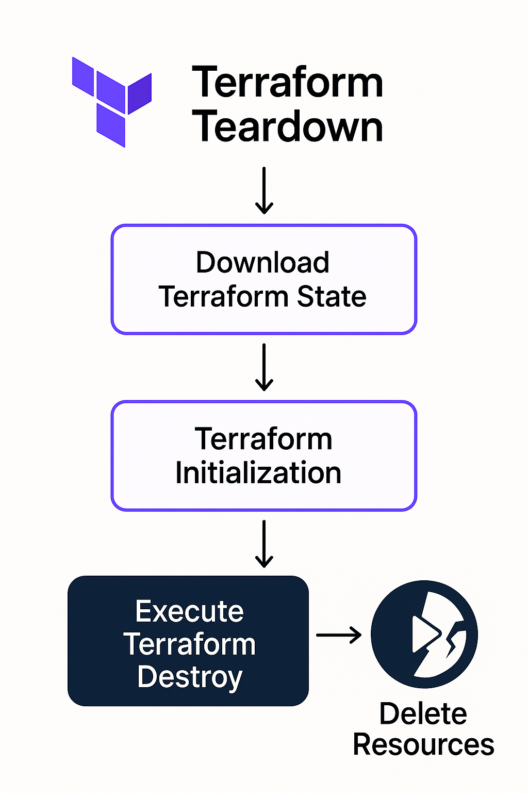

# Ephemeral Pipeline: Automated Teardown and Cost Optimization – Part 3

> In this final installment, we automate the teardown of our ephemeral AWS EC2 infrastructure using Terraform and GitHub Actions to ensure cost optimization and efficiency.

## Introduction

Previously, we set up an ephemeral AWS EC2 infrastructure (Part 1) and configured it to compile Python applications into Android APKs using Docker and Buildozer (Part 2). Now, in Part 3, we focus on automating the teardown of this infrastructure. Automating teardown is crucial for managing resources effectively, reducing costs, and minimizing the risk of resource leaks in cloud environments.

In this final segment, we'll demonstrate how Terraform's destroy command can seamlessly remove the EC2 resources once the build process is complete, ensuring a clean, optimized, and secure workflow.



## Key Points

### Importance of Automated Teardown

- **Cost Management:**
  - Automatically removing ephemeral infrastructure prevents unnecessary charges from idle or forgotten resources.
- **Resource Optimization:**
  - Keeps your AWS environment clean and manageable by eliminating unused resources after completion of builds.

### Terraform State Management

- **Preserving Terraform State:**
  - During previous pipeline stages, we stored Terraform state files (`terraform.tfstate`) as artifacts within GitHub Actions.
- **State Restoration for Teardown:**
  - Download the preserved Terraform state file artifacts before executing the destroy operation, ensuring Terraform knows precisely which resources to remove.

### Automated Teardown Workflow

- **Download Terraform State:**
  - Retrieve Terraform state and lock files from GitHub Actions artifacts.
- **Terraform Initialization:**
  - Initialize Terraform again using the preserved state, ensuring accurate tracking of existing resources.
- **Execute Terraform Destroy:**
  - Run `terraform destroy` command with automated approvals (`-auto-approve`) to efficiently and quickly remove EC2 instances and associated resources.

## GitHub Actions Workflow Steps for Teardown

Here's a quick breakdown of the GitHub Actions job to automate the infrastructure teardown:

### Downloading Terraform State

```yaml
- name: Download terraform state
  uses: actions/download-artifact@v4
  with:
    name: tfstate
    path: .github/test
- uses: hashicorp/setup-terraform@v2
  with: 
    terraform_version: "1.11.4"

- name: Terraform Init
  run: terraform -chdir=.github/test init -input=false

- name: Terraform Destroy
  run: terraform -chdir=.github/test destroy -auto-approve -input=false
'''

## Benefits of This Approach

### Automated Lifecycle Management
Fully automated infrastructure management — from creation to destruction — ensures minimal manual intervention.

### Enhanced Security and Reliability
Reducing resource exposure time and potential vulnerabilities associated with lingering unused infrastructure.

### Cost Efficiency
Effective resource utilization significantly lowers operational costs associated with cloud deployments.

## Conclusion

In this three-part series, we've explored building an ephemeral CI/CD pipeline using AWS EC2, GitHub Actions, Docker, Buildozer, and Terraform. By integrating automated setup, configuration, build, and teardown processes, we achieve a streamlined, cost-effective, and secure solution for compiling Python-based Android apps.

This automated approach empowers developers to maintain consistent build environments, manage resources responsibly, and optimize operational efficiency. By leveraging Terraform's state management and GitHub Actions' automation, teams can confidently scale their software deployment workflows without worrying about unnecessary overhead or escalating cloud costs.

Thank you for following along! Feel free to reach out or comment with your experiences, questions, or suggestions.
